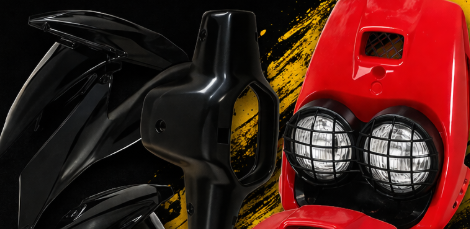
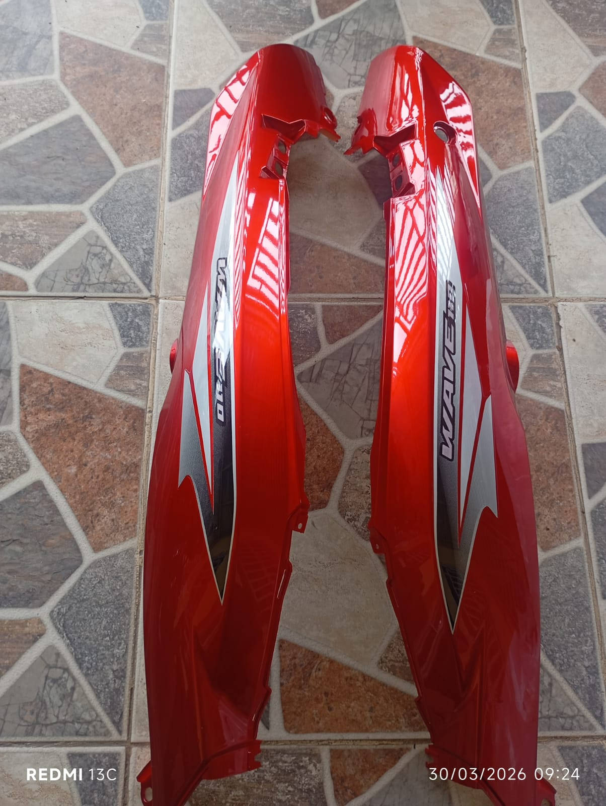
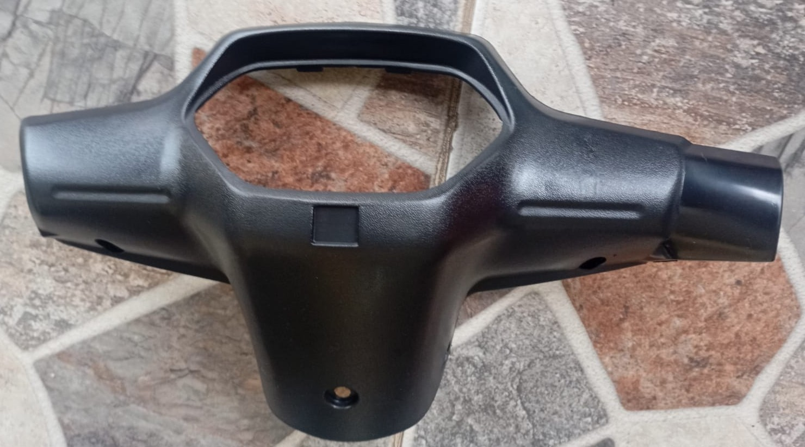
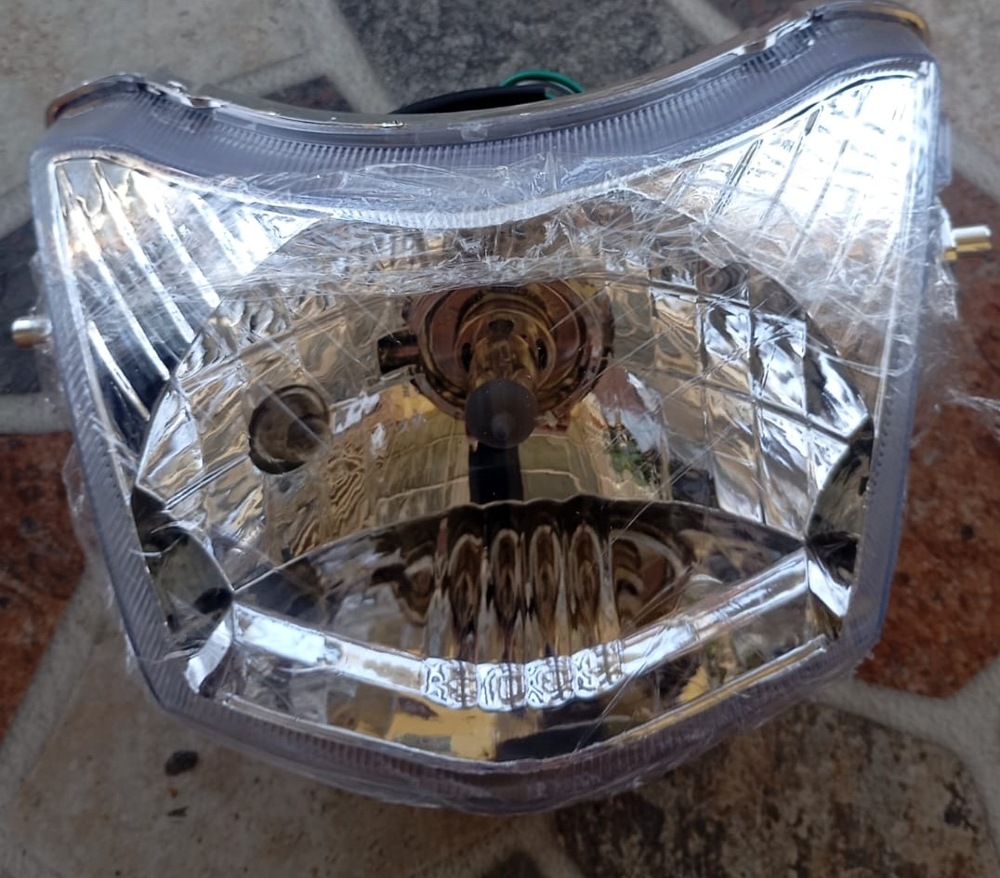
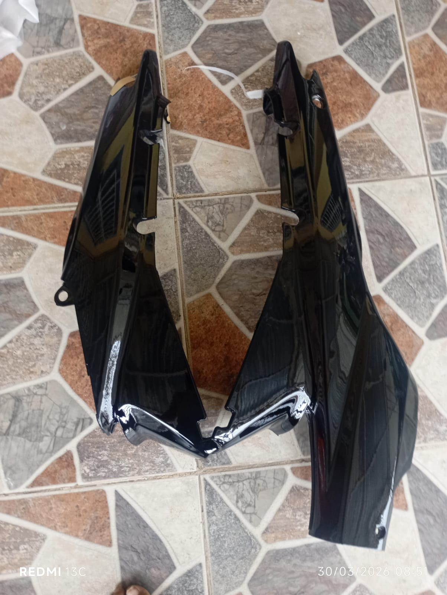
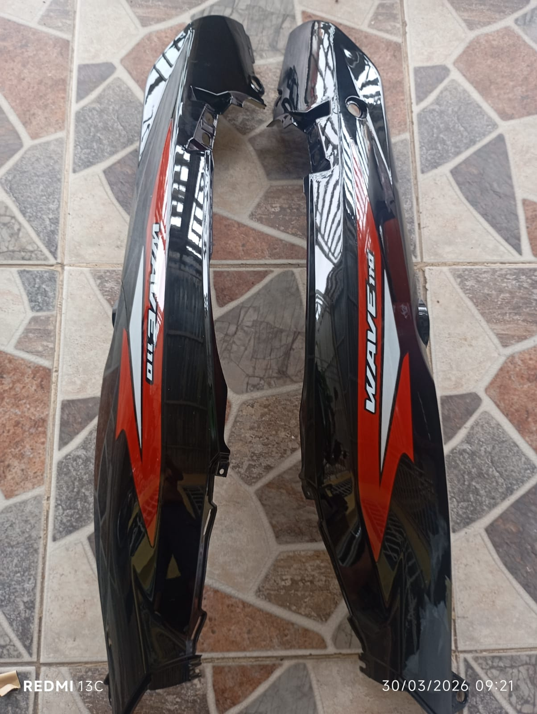
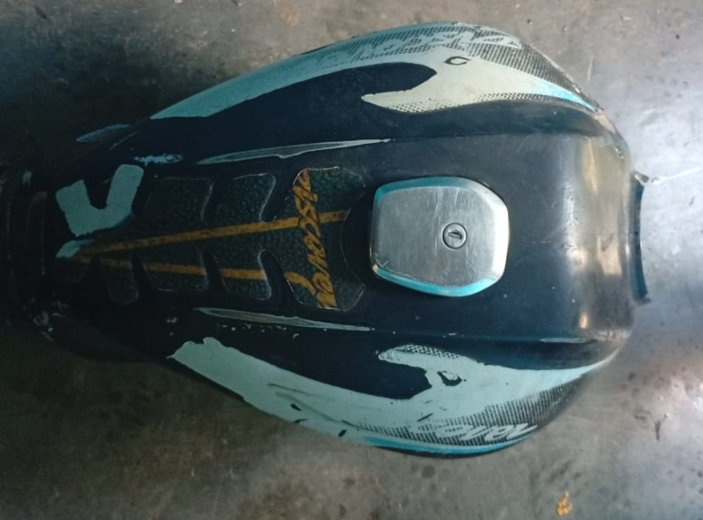
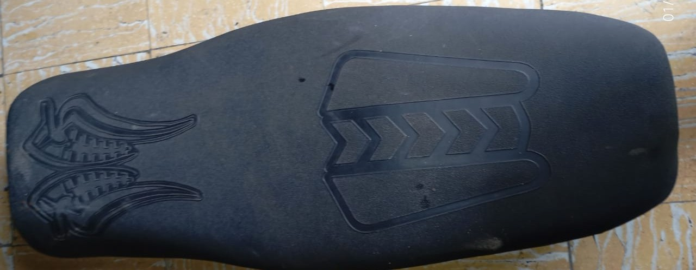

# MundoRepuesto
Moto Repuesto 
<!DOCTYPE html>
<html lang="en">

<head>
    <meta charset="UTF-8">
    <meta name="viewport" content="width=device-width, initial-scale=1.0">
    <title>Inicio</title>
    <link href="https://cdn.jsdelivr.net/npm/bootstrap@5.3.8/dist/css/bootstrap.min.css" rel="stylesheet"
        integrity="sha384-sRIl4kxILFvY47J16cr9ZwB07vP4J8+LH7qKQnuqkuIAvNWLzeN8tE5YBujZqJLB" crossorigin="anonymous">
    <link rel="stylesheet" href="styles.css">
</head>

<body class="table-responsive bg-white p-4 shadow rounded">
    <header>

        

            
        

        <nav class="navbar navbar-expand-lg bg-body-tertiary">
            

                <a class="navbar-brand" href="inicio.html">Mundo Repuestos</a>
                <button class="navbar-toggler" type="button" data-bs-toggle="collapse" data-bs-target="#navbarNav"
                    aria-controls="navbarNav" aria-expanded="false" aria-label="Toggle navigation">
                    
                </button>
                

                    <ul class="navbar-nav">
                        <li class="nav-item">
                            <a class="nav-link active" aria-current="page" href="inicio.html">Inicio</a>
                        </li>
                        <li class="nav-item">
                            <a class="nav-link active" aria-current="page" href="Producto.html">Productos</a>
                        </li>
                        <li class="nav-item">
                            <a class="nav-link" href="contacto.html">Contacto</a>
                        </li>
                    </ul>
                

            

        </nav>
    </header>
    

        

            

                
            

            

                
            

        

        <button class="carousel-control-prev" type="button" data-bs-target="#carouselExample" data-bs-slide="prev">
            
            Previous
        </button>
        <button class="carousel-control-next" type="button" data-bs-target="#carouselExample" data-bs-slide="next">
            
            Next
        </button>
    

    

        <h1 class="titulo_01">
            <em><strong>Bienvenido a Mundo Repuestos</strong></em>
        </h1>

        

            

                <h2>Misión</h2>
                

                    Brindar motos y repuestos de calidad para modelos clásicos,
                    ofreciendo confianza, buen servicio y atención rápida a nuestros
                    clientes en toda Colombia.
                

            

            

                <h2>Visión</h2>
                

                    Ser una empresa reconocida a nivel nacional por la calidad de
                    nuestros repuestos, la confianza de nuestros clientes y nuestro
                    compromiso con el mundo de las motos clásicas.
                

            

        

        <h1 class="titulo_01">
            <em><strong>QUIÉNES SOMOS</strong></em>
        </h1>

        

            Somos una empresa especializada en la compra y venta de motos clásicas
            y repuestos de segunda y nuevos para modelos como Chappy, AKT 110,
            Wave C100 y Biz C100.
              

            Ofrecemos repuestos de excelente calidad, atención personalizada
            y servicio contra entrega a nivel nacional en toda Colombia.
              

            <strong>📞 Contáctanos:</strong> 317 753 7993
        

    

    <a class="whatsapp" href="https://wa.me/573177537993">
        💬
    </a>

    <footer>
        © 2026 Mundo Repuestos - Todos los derechos reservados
    </footer>

    
</body>

</html>

<!DOCTYPE html>
<html lang="en">

<head>
    <meta charset="UTF-8">
    <meta name="viewport" content="width=device-width, initial-scale=1.0">
    <title>Contacto - Mundo Repuestos</title>
    <link href="https://cdn.jsdelivr.net/npm/bootstrap@5.3.8/dist/css/bootstrap.min.css" rel="stylesheet"
        integrity="sha384-sRIl4kxILFvY47J16cr9ZwB07vP4J8+LH7qKQnuqkuIAvNWLzeN8tE5YBujZqJLB" crossorigin="anonymous">
    <link rel="stylesheet" href="formulario.css">

</head>

<body>

    

        <header>

            

                
            

            <nav class="navbar navbar-expand-lg bg-body-tertiary">
                

                    <a class="navbar-brand" href="inicio.html">Mundo Repuestos</a>
                    <button class="navbar-toggler" type="button" data-bs-toggle="collapse" data-bs-target="#navbarNav"
                        aria-controls="navbarNav" aria-expanded="false" aria-label="Toggle navigation">
                        
                    </button>
                    

                        <ul class="navbar-nav">
                            <li class="nav-item">
                                <a class="nav-link active" aria-current="page" href="inicio.html">Inicio</a>
                            </li>
                            <li class="nav-item">
                                <a class="nav-link active" aria-current="page" href="Producto.html">Productos</a>
                            </li>
                            <li class="nav-item">
                                <a class="nav-link" href="contacto.html">Contacto</a>
                            </li>
                        </ul>
                    

                

            </nav>

        </header>
        

            <h2>Mundo Repuestos</h2>

            <form id="whatsappForm">

                

                    <label>Nombre del Cliente</label>
                    <input type="text" id="nombre" placeholder="Ingrese su nombre" required>
                

                

                    <label>Número de Teléfono</label>
                    <input type="tel" id="telefono" placeholder="Ingrese su número" required>
                

                

                    <label>Producto Solicitado</label>
                    <textarea id="producto" placeholder="Escriba el producto que necesita" required></textarea>
                

                <button type="submit" class="btn">
                    Enviar por WhatsApp
                </button>

            </form>
        

        

    

    
</body>

</html>

<!DOCTYPE html>
<html lang="en">

<head>
    <meta charset="UTF-8">
    <meta name="viewport" content="width=device-width, initial-scale=1.0">
    <title>Producto_Mundo Repuestos</title>
    <link href="https://cdn.jsdelivr.net/npm/bootstrap@5.3.8/dist/css/bootstrap.min.css" rel="stylesheet"
        integrity="sha384-sRIl4kxILFvY47J16cr9ZwB07vP4J8+LH7qKQnuqkuIAvNWLzeN8tE5YBujZqJLB" crossorigin="anonymous">
    <link rel="stylesheet" href="styles.css">
</head>

<body>
    <header>

        

            
        

        <nav class="navbar navbar-expand-lg bg-body-tertiary">
            

                <a class="navbar-brand" href="inicio.html">Mundo Repuestos</a>
                <button class="navbar-toggler" type="button" data-bs-toggle="collapse" data-bs-target="#navbarNav"
                    aria-controls="navbarNav" aria-expanded="false" aria-label="Toggle navigation">
                    
                </button>
                

                    <ul class="navbar-nav">
                        <li class="nav-item">
                            <a class="nav-link active" aria-current="page" href="inicio.html">Inicio</a>
                        </li>
                        <li class="nav-item">
                            <a class="nav-link active" aria-current="page" href="Producto.html">Productos</a>
                        </li>
                        <li class="nav-item">
                            <a class="nav-link" href="contacto.html">Contacto</a>
                        </li>
                    </ul>
                

            

        </nav>

    </header>

    <section id="productos">

        <h2 class="title">Nuestros Repuestos</h2>

        

            

                
                

                    <a href="contacto.html" class="btn">Consultar</a>
                

            

            

                
                

                    <a href="contacto.html" class="btn">Consultar</a>
                

            

            

                
                

                    <a href="contacto.html" class="btn">Consultar</a>
                

            

            

                
                

                    <a href="contacto.html" class="btn">Consultar</a>
                

            

            

                
                

                    <a href="contacto.html" class="btn">Consultar</a>
                

            

            

                
                

                    <a href="contacto.html" class="btn">Consultar</a>
                

            

            

                
                

                    <a href="contacto.html" class="btn">Consultar</a>
                

            

            

                
                

                    <a href="contacto.html" class="btn">Consultar</a>
                

            

            

                
                

                    <a href="contacto.html" class="btn">Consultar</a>
                

            

        

    </section>

    <footer>
        © 2026 Mundo Repuestos - Todos los derechos reservados
    </footer>

    <a class="whatsapp" href="https://wa.me/573187279750">
        💬
    </a>

    
</body>

</html>
